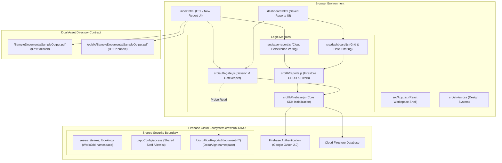
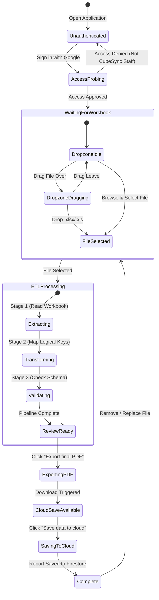
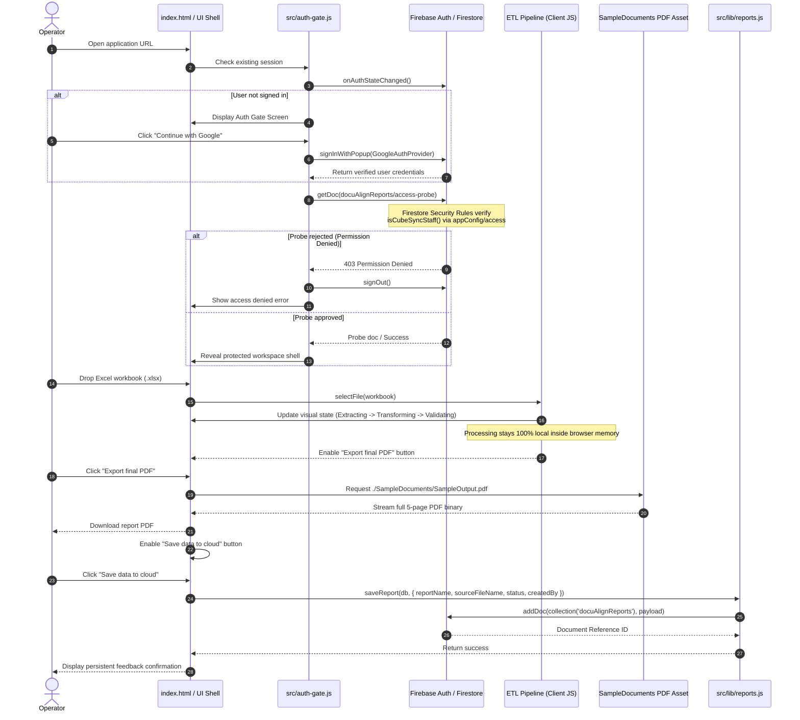
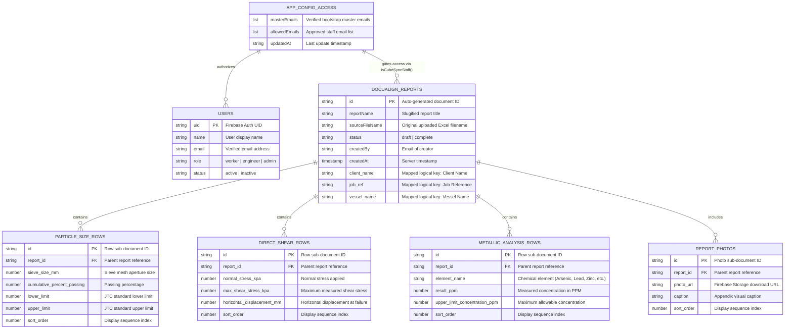

# DocuAlign System Design & Architecture Specification

## 1. Executive Summary & Purpose

**DocuAlign** is an enterprise laboratory reporting web application built to modernize and structure the current manual workflow of converting spreadsheet test data into standardized, audit-ready PDF engineering reports.

### The Problem
Laboratory test reports for geotechnical and reclamation sand testing are currently maintained in Microsoft Excel workbooks. Operators manually copy or position test results from Excel into desktop PDF editing software (such as Adobe Acrobat). This manual workflow introduces severe operational risks:
1. **Layout Fragility:** Font rendering, scaling, and table alignment shift between different desktop computers, operating systems, and PDF editor versions.
2. **Data Isolation:** Data locked inside desktop Excel workbooks and flat PDFs cannot be searched, filtered, audited, or tracked over time across an enterprise.
3. **Reproduction Overhead:** Regenerating or correcting a historical report requires repeating the error-prone manual positioning process from scratch.

### The DocuAlign Solution
DocuAlign establishes a clean decoupling between **Source Data** (Excel workbook), **Structured Persistence** (Firebase Cloud Firestore), and **Presentation Output** (Standardized PDF Export):
1. **Ingestion (ETL):** Operators drag and drop laboratory workbooks into the secure web interface. Processing occurs entirely locally on the client device during initial extraction.
2. **Structured Review:** Values are mapped into logical report keys based on visible domain labels rather than unreliable AcroForm field identifiers.
3. **Persistent Records:** Verified report data is saved directly into cloud storage (`docuAlignReports`), enabling full historical dashboard tracking and date filtering.
4. **Consistent Output:** Final PDF documents are exported from controlled templates that guarantee bit-for-bit visual layout consistency regardless of the operating environment.

---

## 2. High-Level System Architecture

DocuAlign is built using a hybrid **Multi-Page Application (MPA)** and **Modular Frontend** architecture powered by **Vite**, **React**, **Vanilla ES Modules**, and **Firebase SDK v12**.



### Module Responsibilities
* **`index.html`**: Primary landing page providing local drag-and-drop workbook ingestion, visual progression through the three-stage ETL pipeline (`Extract`, `Transform`, `Validate`), PDF download triggers, and cloud saving.
* **`dashboard.html`**: Cloud dashboard enabling authenticated staff to browse historical reports, view metadata (source filename, creator, timestamp), and filter records dynamically by date range.
* **`src/auth-gate.js`**: Enforces strict enterprise access control. Restricts UI access until a verified Google session passes an active Firestore probe against `docuAlignReports/access-probe`.
* **`src/lib/reports.js`**: Pure domain library providing server-timestamped document creation (`saveReport`), descending ordered retrieval (`fetchReports`), and client-side date range filtering (`filterReportsByDate`).
* **`src/lib/firebase.js`**: Singleton initialization of Firebase App, Firestore, Auth, and Storage with HMR/test environment protection (`getApps().length`).

---

## 3. UML Behavioral & Workflow Diagrams

### 3.1 ETL & UI State Machine Diagram
The frontend progresses through well-defined operational states to ensure users verify workbook data before cloud persistence.



### 3.2 End-to-End Sequence Diagram
Illustrates the chronological interaction between the user, browser modules, local static assets, and cloud backend during report creation.



---

## 4. Entity-Relationship (E/R) Data Model

DocuAlign shares a Firestore database instance with `WorkGrid` and `CubeSync`. To prevent data corruption and ensure clean namespace isolation, all DocuAlign records live under `docuAlignReports/{document=**}`.

### 4.1 Global Shared Firestore Ecosystem E/R Diagram



### 4.2 Logical Field Key Mapping Strategy
Because uploaded Excel-generated PDFs lack AcroForm field dictionaries, DocuAlign maps source Excel cells directly to semantic domain keys defined in `rak_pdf_excel_field_mapping.json`:

| Semantic Section | Logical Key | Excel Source Example | Description |
| :--- | :--- | :--- | :--- |
| **Cover Page** | `client_name` | `'CV1 (2)'!K5` | Client corporate identity |
| **Cover Page** | `project_code_title` | `'CV1 (2)'!K12` | Project specification title |
| **Cover Page** | `job_ref` | `'CV1 (2)'!K15` | Unique laboratory tracking reference |
| **Test Metadata** | `sampling_date` | `'CV1 (2)'!K18` | Field sampling date |
| **Grading Table** | `particle_size_distribution` | Repeatable Subcollection | Sieve test row collection |
| **Shear Test** | `direct_shear` | Repeatable Subcollection | Shear stress evaluation points |
| **Signatures** | `authorised_by_name` | `'CV1 (2)'!Footer` | Certifying laboratory officer |

---

## 5. Security & Access Control Architecture

Security rules are enforced on the server via `firestore.rules`. Client-side UI checks (`auth-gate.js`) provide immediate UX gating, but cloud data is guarded exclusively by Firebase Security Rules.

### 5.1 Shared Rules Contract
The database instance hosts WorkGrid, CubeSync, and DocuAlign. Security rules must strictly preserve existing rules blocks while defining isolated access for DocuAlign:

```text
service cloud.firestore {
  match /databases/{database}/documents {
    // Shared allowlist check used by both CubeSync and DocuAlign
    function isCubeSyncStaff() {
      return isVerifiedEmail() &&
        (isHardcodedStaff() ||
          (hasAccessConfig() &&
            ('allowedEmails' in accessConfig() &&
              request.auth.token.email.lower() in accessConfig().allowedEmails)));
    }

    // DocuAlign Dedicated Namespace Block
    match /docuAlignReports/{document=**} {
      allow read, write: if isCubeSyncStaff();
    }
  }
}
```

### 5.2 Access Probing Mechanism
When a user authenticates via Google OAuth, `src/auth-gate.js` performs a probe read against `docuAlignReports/access-probe`:
1. If the user's email is present in `appConfig/access.allowedEmails` or hardcoded masters, Firestore allows the read. The application shell opens.
2. If the read fails with `permission-denied`, the user is immediately logged out and shown an access rejection notice.

---

## 6. Asset Contract & Deployment Topology

To ensure seamless execution across both local filesystem development (`file://`) and production HTTP deployments (Vite build output), DocuAlign enforces a **Dual Asset Directory Contract**:

```text
DocuAlign/
├── SampleDocuments/
│   ├── SampleOutput.pdf               <-- Serves direct index.html file:// opening
│   ├── SampleOutput-cover.pdf
│   └── SampleInput.xlsx
├── public/
│   └── SampleDocuments/
│       ├── SampleOutput.pdf           <-- Copied by Vite into dist/ for HTTP servers
│       └── SampleOutput-cover.pdf
```

Vitest automated verification (`src/pdf-export.test.js`) verifies that both PDF assets exist, share the exact same SHA-256 cryptographic hash, and contain the full five pages (`%PDF-` signature check).
