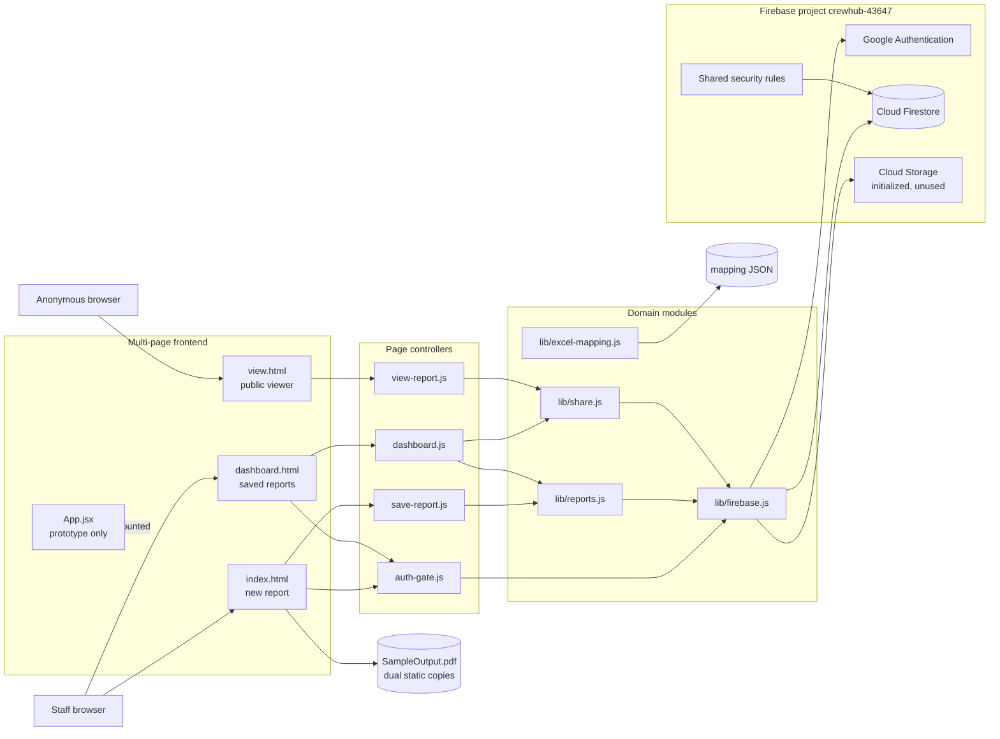
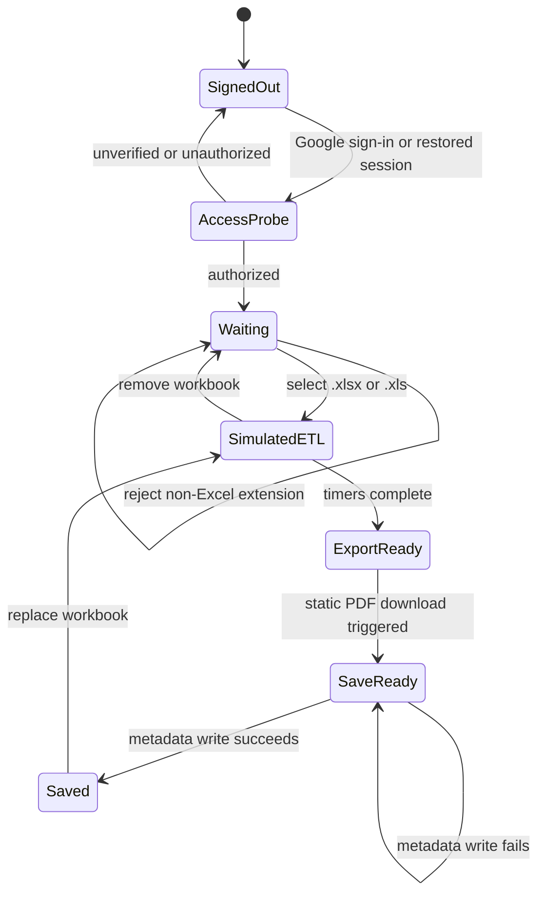
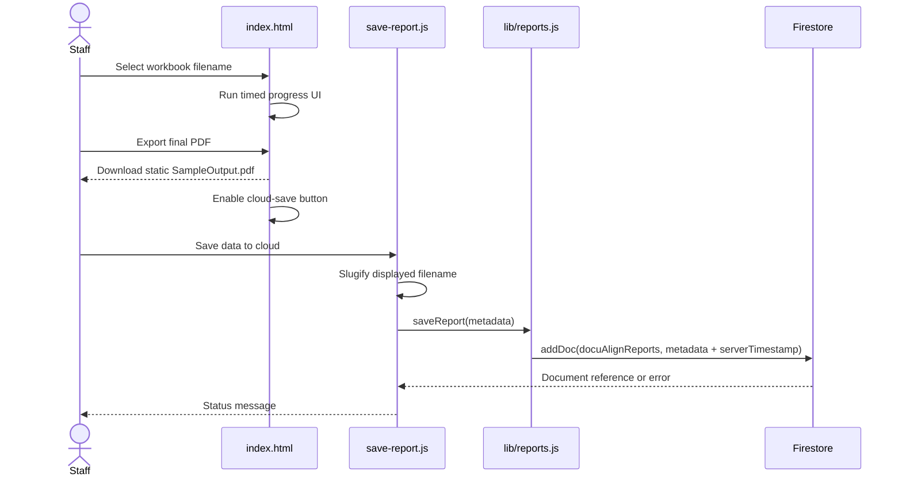
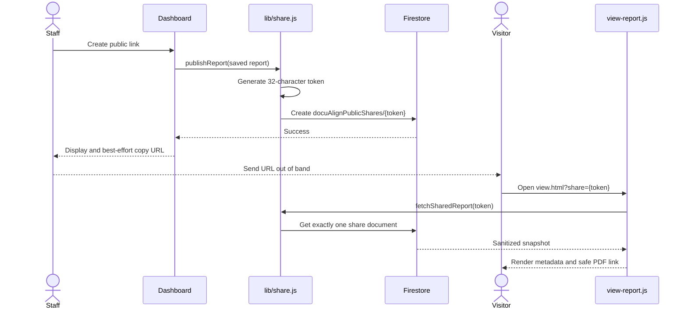
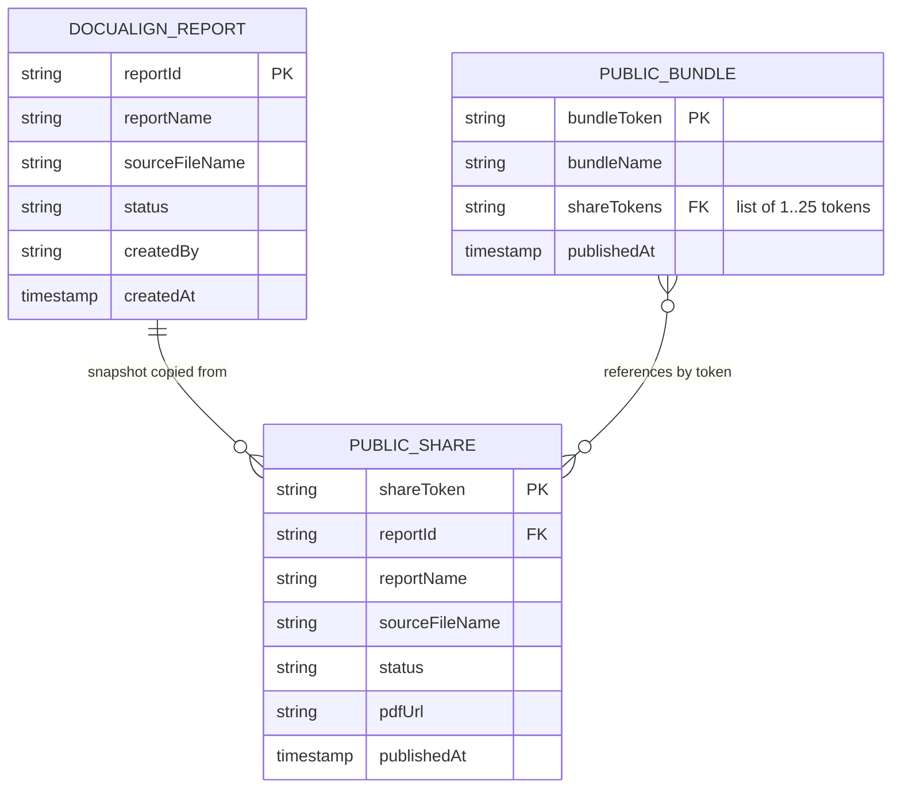
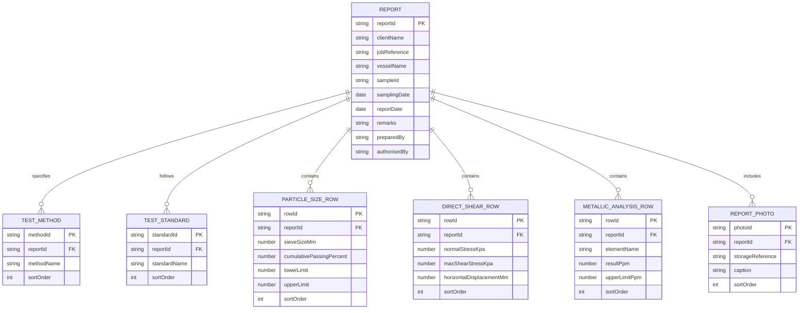

# DocuAlign Project Guide

## 1. Purpose and current status

DocuAlign is a browser-based workspace for the RAK laboratory report workflow. Its intended direction is Excel source data → semantic report data → stable PDF output. The current implementation is an authenticated prototype with report metadata persistence, a saved-report dashboard, and capability-based public links.

This distinction is important:

| Capability | Current implementation | Status |
| --- | --- | --- |
| Select `.xlsx` or `.xls` files | Validates the filename extension and displays the selected file | Implemented |
| Extract workbook cells | Mapping utilities accept an already-created cell lookup; the UI does not read workbook bytes | Domain utility only |
| ETL progress | Timed UI transitions labelled Extract, Transform, and Validate | Prototype simulation |
| Review or edit extracted data | No review form is connected | Not implemented |
| Save reports | Saves report name, source filename, status, creator email, and server timestamp | Implemented metadata only |
| PDF generation | Downloads the bundled five-page `SampleOutput.pdf` reference | Static reference export |
| Saved-report dashboard | Lists, date-filters, deletes, and shares report metadata | Implemented |
| Single public links | Publishes an immutable, sanitized Firestore snapshot | Implemented |
| Group public links | Publishes 1–25 single shares and a bundle of their tokens | Implemented |

The UI wording describes the target workflow, but selecting a workbook does not currently parse or upload its contents. Any future implementation should preserve the semantic mapping contract in `rak_pdf_excel_field_mapping.json` and should update this status table when behavior changes.

## 2. Technology and execution model

- Frontend: vanilla HTML, CSS, and ES modules for the deployed multi-page application.
- Additional UI: `src/App.jsx` is a tested React prototype, but `src/main.jsx` is not loaded by any current HTML entry point.
- Build: Vite 6 with three entries: `index.html`, `dashboard.html`, and `view.html`.
- Backend services: Firebase Authentication, Cloud Firestore, optional Analytics initialization, and an initialized but currently unused Storage client.
- Tests: Vitest, Testing Library, Happy DOM, V8 coverage, and optional Firestore emulator tests.
- Security: a single shared `firestore.rules` file for DocuAlign, WorkGrid, and CubeSync.

The HTML pages contain an import map for direct browser module loading from the Firebase CDN. Vite resolves the same bare Firebase imports from npm for development and production builds.

## 3. Repository map

| Path | Responsibility |
| --- | --- |
| `index.html` | Protected new-report page; file selection, simulated pipeline, static PDF download |
| `dashboard.html` | Protected saved-report dashboard shell |
| `view.html` | Unauthenticated single-share and bundle viewer shell |
| `src/auth-gate.js` | Google sign-in, session handling, verified-email check, Firestore access probe |
| `src/save-report.js` | Persists metadata from the selected filename |
| `src/dashboard.js` | Fetch, render, filter, delete, publish, group, and copy-link behavior |
| `src/view-report.js` | Resolves public tokens, renders safe text, guards PDF URLs |
| `src/lib/firebase.js` | Firebase singleton initialization |
| `src/lib/reports.js` | Firestore report CRUD, timestamp normalization, inclusive date filtering |
| `src/lib/share.js` | Token generation, public payload allowlisting, share and bundle persistence |
| `src/lib/excel-mapping.js` | Query, extraction-from-lookup, and minimum-structure validation for 66 mappings |
| `rak_pdf_excel_field_mapping.json` | Five-page, 66-field semantic mapping specification |
| `src/styles.css` | Shared visual tokens and page styling |
| `firestore.rules` | Shared production authorization boundary |
| `src/firestore.rules.test.js` | Emulator-gated authorization contract tests |
| `SampleDocuments/` | Direct-filesystem sample input and PDF references |
| `public/SampleDocuments/` | Copies emitted by Vite into the production build |
| `vite.config.js` | MPA entries and coverage configuration |

## 4. UML component diagram



`src/lib/excel-mapping.js` is tested but not connected to `index.html`. No Excel parsing library is installed, and the selected `File` object is not read.

## 5. Runtime workflows

### 5.1 Authentication and authorization

Both protected pages load `src/auth-gate.js`.

1. Firebase restores or establishes a Google session with local persistence.
2. The client rejects an unverified email before attempting data access.
3. The client reads `docuAlignReports/access-probe`.
4. Firestore evaluates `isDocuAlignStaff()`, an alias of the shared `isCubeSyncStaff()` helper.
5. Success reveals the protected application. `permission-denied` signs the user out and shows a denial.

The access-probe document does not need to exist: an authorized Firestore `get` of a missing document still proves that rules allowed the operation. The UI gate is a usability control; Firestore rules are the security boundary.

### 5.2 New-report state machine



The `SimulatedETL` state does not inspect workbook content. Its timers only update CSS classes and messages.

### 5.3 Report save sequence



The saved record contains no extracted laboratory measurements and no workbook binary.

### 5.4 Dashboard and sharing

The dashboard fetches every `docuAlignReports` document ordered by `createdAt` descending, normalizes timestamps, and filters dates in browser memory. Delete uses a two-click arm/confirm interaction and permanently deletes only the report document; it does not discover or revoke existing public shares.

For a single link, `publishReport` creates a random 32-character alphanumeric token using `crypto.getRandomValues` with rejection sampling. It writes only `reportId`, display name, nullable source filename, status, static PDF path, and server publication timestamp. The staff creator email and unknown report fields are excluded.

For a group link, `publishBundle` first publishes every selected report as a normal share, then stores 1–25 share tokens in a bundle. Fetching a bundle performs one read for the bundle and one read for each member. Missing or revoked member shares are dropped.



## 6. Data model

### 6.1 Implemented Firestore documents

Firestore is schemaless; the shapes below are the application and rules contract.

`docuAlignReports/{reportId}`:

| Field | Type | Written by current UI | Notes |
| --- | --- | --- | --- |
| `reportName` | string | Yes | Slug derived from source filename |
| `sourceFileName` | string | Yes | Browser-displayed filename only |
| `status` | string | Yes | Currently `complete` |
| `createdBy` | string/null | Yes | Authenticated staff email; private namespace only |
| `createdAt` | timestamp | Yes | Firestore server timestamp |
| Other nested fields | any | Allowed for staff | Rules intentionally grant the dedicated namespace recursively, but the UI writes none |

`docuAlignPublicShares/{shareToken}`:

| Field | Type | Constraint |
| --- | --- | --- |
| document ID | string | Exactly 32 alphanumeric characters |
| `reportId` | string | 1–128 characters |
| `reportName` | string | 1–200 characters |
| `sourceFileName` | string/null | Optional, at most 200 characters |
| `status` | string | 1–40 characters |
| `pdfUrl` | string | 1–500 characters; current publisher uses static relative path |
| `publishedAt` | timestamp | Server timestamp/current request time |

`docuAlignPublicBundles/{bundleToken}`:

| Field | Type | Constraint |
| --- | --- | --- |
| document ID | string | Exactly 32 alphanumeric characters |
| `bundleName` | string/null | Optional, at most 200 characters |
| `shareTokens` | list<string> | 1–25 valid share tokens |
| `publishedAt` | timestamp | Server timestamp/current request time |

### 6.2 E/R diagram: implemented persistence

Firestore does not enforce foreign keys. The relationships are logical references, and deleting a report does not cascade to shares or bundles.



The report-to-share relationship is not dereferenced by the viewer; the share is a copied, immutable snapshot. A bundle dereferences its tokens at view time.

### 6.3 Target structured-report model

The README and mapping file describe a future structured laboratory record with cover metadata, test methods and standards, particle-size rows, direct-shear rows, metallic-analysis rows, signatures, and appendix photos. Those entities are conceptual, not current Firestore collections. A future schema may embed them under `docuAlignReports` or use nested subcollections, but that decision has not been implemented.



This conceptual diagram is normalized for clarity; it does not prescribe SQL tables or separate top-level Firestore collections. Summary results such as moisture, organic matter, silt/coral content, and direct-shear density may live on the report or in section objects once a versioned storage contract is chosen.

If repeatable data is introduced, prefer references or subcollections where deep list validation could approach Firestore's 1,000-expression rules limit. Read `firestore-rules-expression-limit.md` before changing validators.

## 7. Excel mapping contract

`rak_pdf_excel_field_mapping.json` contains 66 mappings over PDF pages 1–5 and these sections: Cover, Header, Particle Size Distribution, Silt and Coral/Shell Content, Moisture Content, Direct Shear, Organic Matter, Metallic Analysis, Sign off, and Appendix.

Every mapping supplies a semantic `suggested_key`; many also identify an Excel sheet/range, a displayed PDF value, transformation guidance, confidence, and notes. These keys are application-domain identifiers, not AcroForm names: the reference PDF has no usable form dictionary.

`src/lib/excel-mapping.js` currently provides:

- `getMappingsByPage(pageNumber)`;
- `getMappingsBySection(sectionName)`;
- `getSheetNames()`;
- `extractMappedReport(rawCellLookup)`, which maps exact cell-reference keys to semantic keys;
- `validateFullReportStructure(reportData)`, which requires five representative keys.

The module does not open XLS/XLSX files, calculate workbook formulas, expand ranges, normalize values, or render a PDF. A production ingestion pipeline needs an explicit workbook reader and tests using `SampleDocuments/SampleInput.xlsx`.

## 8. Security model and invariants

The Firebase project and rules file are shared with WorkGrid and CubeSync. DocuAlign changes must remain in these blocks only:

- `match /docuAlignReports/{document=**}`;
- `match /docuAlignPublicShares/{shareToken}`;
- `match /docuAlignPublicBundles/{bundleToken}`.

Protected reports use the shared staff decision through `isDocuAlignStaff()` → `isCubeSyncStaff()`. Public resources deliberately use capability URLs:

- anonymous `get` is allowed;
- `list` is always denied;
- only staff may create or delete;
- updates are always denied;
- token IDs remain 32-character alphanumeric strings;
- payload keys are allowlisted, excluding staff email and arbitrary PII;
- bundles contain tokens only and are limited to 25 members.

`view-report.js` additionally accepts only simple relative paths or `https://` PDF URLs. Unsafe, malformed, plain-HTTP, protocol-relative, `data:`, and `javascript:` values fall back to `SampleDocuments/SampleOutput.pdf`. This is defense in depth; the rules currently constrain length and keys but do not constrain the URL scheme.

Capability URLs should be treated as secrets. Anyone holding one can read its public snapshot until a staff user deletes the corresponding share. There is no expiry, audience restriction, access log, share-management UI, or automatic cascade revocation.

## 9. Static PDF and asset contract

`SampleDocuments/SampleOutput.pdf` supports relative URLs when the root HTML file is opened directly. `public/SampleDocuments/SampleOutput.pdf` is copied into Vite output for HTTP/HTTPS deployments. Both copies must remain byte-identical. The same dual-location convention currently exists for `SampleOutput-cover.pdf`.

`src/pdf-export.test.js` checks the full report's PDF signature, five-page marker, and SHA-256 equality. The application does not modify this PDF with selected workbook data.

Authentication cannot operate on `file://`; use the Vite server or a deployed authorized domain. Direct-file asset compatibility does not imply that the full application works without HTTP.

## 10. Development and operations

Prerequisites: a current Node.js release compatible with Vite 6 and dependencies installed from `package-lock.json`.

```bash
npm ci
npm run dev
npm run build
npm run preview
```

Quality gates required after repository changes:

```bash
npm run lint
npm test
npm run coverage
```

Rules changes also require the Firestore emulator suite:

```bash
npx firebase-tools emulators:exec --only firestore --project demo-docualign \
  "RUN_FIRESTORE_RULE_TESTS=1 FIRESTORE_EMULATOR_HOST=127.0.0.1:8087 npm run test:rules"
```

The ordinary `npm test` run skips emulator-backed cases unless `RUN_FIRESTORE_RULE_TESTS=1` is set. A green default suite therefore does not prove the deployed rules contract.

The coverage configuration includes `src/**/*.{js,jsx}`, excludes `src/main.jsx` and tests, and targets the repository's 100% statements/branches/functions/lines baseline.

Before deployment:

1. Enable Google Authentication for Firebase project `crewhub-43647`.
2. Add the deployment hostname to Firebase Authentication authorized domains.
3. Build all three Vite page entries.
4. Verify both static PDF copies remain identical.
5. Deploy the shared rules without changing unrelated WorkGrid or CubeSync blocks.
6. Run emulator rules tests, including maximum-size bundle coverage.

## 11. Known limitations and next implementation boundaries

1. Workbook selection is not ingestion. Add a parser before claiming extracted or validated report data.
2. The ETL timer should be replaced with observable processing states and validation errors.
3. `extractMappedReport` needs an adapter from real workbook cells/ranges and formula behavior.
4. Saved reports need a versioned structured schema before CRUD can cover laboratory values.
5. PDF export needs a deterministic renderer that consumes saved data; the sample PDF must remain identified as a reference until then.
6. Share revocation exists in rules/domain semantics but has no dashboard control for locating and deleting a share document.
7. Deleting a private report does not revoke its existing snapshots.
8. Bundle publication is not atomic: if a later write fails, earlier member shares remain published.
9. `src/App.jsx` duplicates part of the vanilla import UI and should either be integrated deliberately or retired.
10. Firebase Storage is initialized but unused; appendix-photo storage and its authorization contract remain undefined.

## 12. Documentation index

- `README.md`: product context, domain fields, and feature overview.
- `design.md`: compatibility entry point to this canonical guide.
- `rak_pdf_excel_field_mapping.json`: authoritative semantic field mapping.
- `documentation/firestore-rules-expression-limit.md`: rules-cost diagnosis and design constraints.
- `AGENTS.md`: mandatory contributor rules and quality gates.
