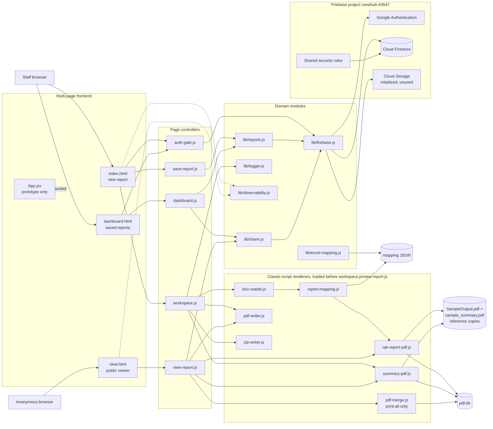
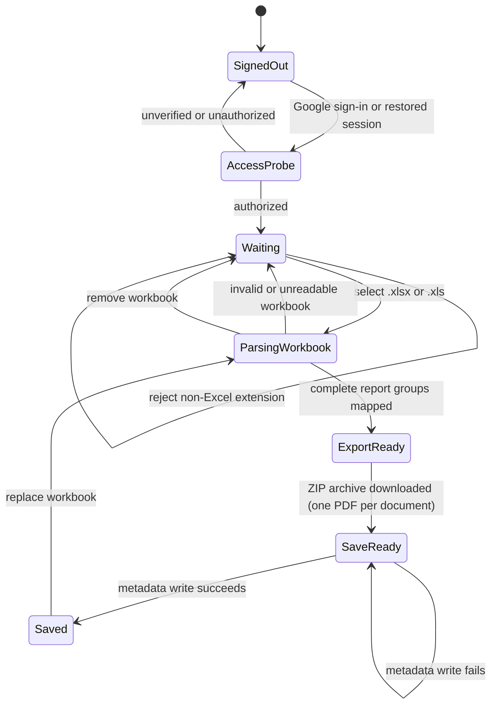
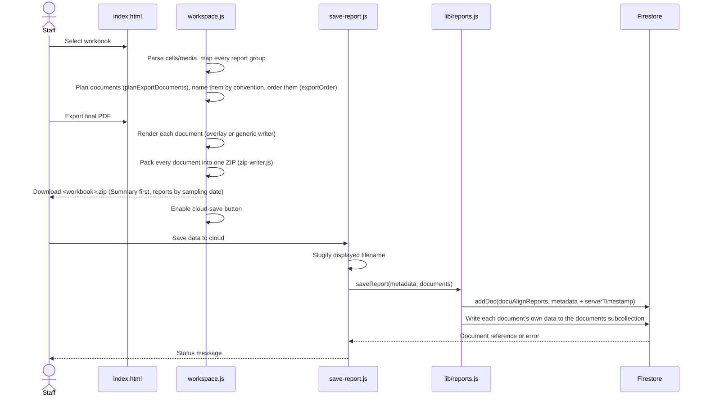
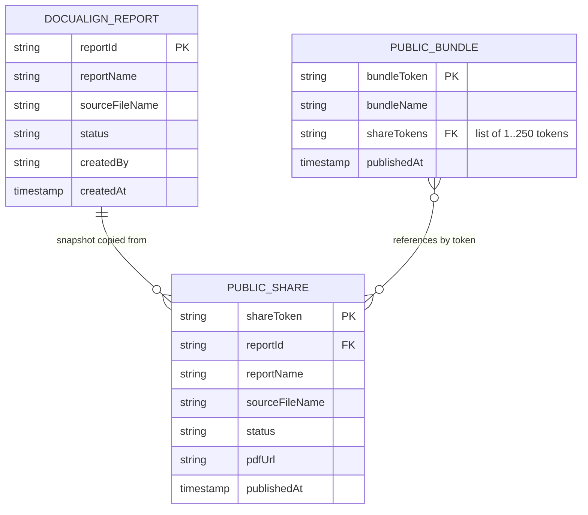
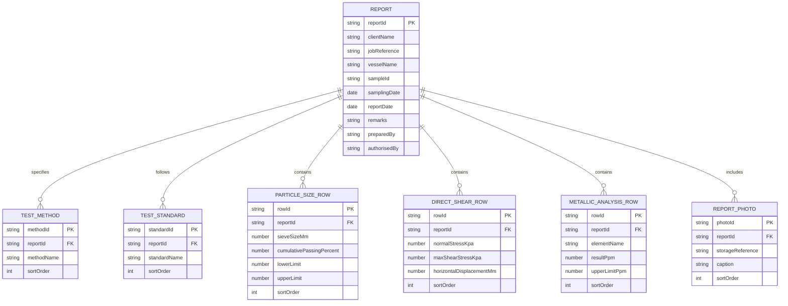

# DocuAlign Project Guide

## 1. Purpose and current status

DocuAlign is a browser-based workspace for the RAK laboratory report workflow. Its intended direction is Excel source data → semantic report data → stable PDF output. The current implementation is an authenticated prototype with report metadata persistence, a saved-report dashboard, and capability-based public links.

This distinction is important:

| Capability | Current implementation | Status |
| --- | --- | --- |
| Select `.xlsx` or `.xls` files | Validates the filename extension and displays the selected file | Implemented |
| Extract workbook cells | Dependency-free reader (`src/xlsx-reader.js`) parses every worksheet, its number formats, and embedded drawing/media, entirely client-side | Implemented |
| ETL progress | Reflects real workbook reading, preparation, and validation states | Implemented |
| Review or edit extracted data | No review form is connected | Not implemented |
| Save reports | Saves report name, source filename, status, creator email, server timestamp, and a `documents` subcollection of the exported documents' own data | Implemented |
| PDF export | Renders one PDF per document (Summary + one five-page overlay per `CV1`/`TR1` report group; `DS1`/`SB1`/`coral + org` are planned but currently withheld — see §1a), names each by the lab's convention (`X-2026-1338 (AV-2620N_RAK SUMMARY)`, `…_RAK1`, `…_RAK2`, …) and packs them into one ZIP download | Implemented |
| Saved-report dashboard | Lists, date-filters, deletes, and shares report metadata and documents | Implemented |
| Single public links | Publishes an immutable, sanitized Firestore snapshot per document | Implemented |
| Package (group) public links | Publishes 1–250 single shares and a bundle of their tokens, with one-click "download all" and "print all" on the viewer | Implemented |

Workbook parsing and PDF generation stay local to the browser; workbook bytes
are not uploaded. Each complete report group is mapped into its own five-page
RAK template overlay. The sample workbook contains six groups plus the Summary,
and its export therefore downloads as **one ZIP archive holding 7 separate
PDFs** — never one combined document. See §5.3 for the export sequence and
`documentation/report-export-static-asset-fix.md` §12 for why a single merged
PDF was tried and rejected as the export's output (it survives only as the
package viewer's print-all mechanism, which never delivers a file).

### 1a. Temporary export restriction

Only the `CV1` + `TR1` test reports and the `Summary` document are exported
today. `SampleInput.xlsx` therefore downloads and saves **7** documents, not
the 20 the full pipeline plans (6 reports + 6 `DS1` + 6 `SB1` + Summary +
`coral + org`). The `DS1`/`SB1` datasheets and remaining standalone worksheets
are still planned, rendered, and serialised by the existing code — they are
only withheld by `TEMPORARILY_DISABLED_DOCUMENT_KINDS` in `src/workspace.js`.
Clearing that list restores the full export.

## 2. Technology and execution model

- Frontend: vanilla HTML, CSS, and ES modules for the deployed multi-page application.
- Additional UI: `src/App.jsx` is a tested React prototype, but `src/main.jsx` is not loaded by any current HTML entry point.
- Build: Vite 6 with three entries: `index.html`, `dashboard.html`, and `view.html`.
- Backend services: Firebase Authentication, Cloud Firestore, optional Analytics initialization, and an initialized but currently unused Storage client.
- Tests: Vitest, Testing Library, Happy DOM, V8 coverage, and optional Firestore emulator tests.
- Security: a single shared `firestore.rules` file for DocuAlign, WorkGrid, and CubeSync.

The HTML pages contain an import map for direct browser module loading from the Firebase CDN. Vite resolves the same bare Firebase imports from npm for development and production builds.

## 3. Repository map

| Path | Responsibility |
| --- | --- |
| `index.html` | Protected new-report page; semantic workbook ingestion and ZIP export download |
| `dashboard.html` | Protected saved-report dashboard shell |
| `view.html` | Unauthenticated single-share and package (bundle) viewer shell |
| `src/auth-gate.js` | Google sign-in, session handling, verified-email check, Firestore access probe |
| `src/workspace.js` | `index.html` controller: pipeline state, document planning (`planExportDocuments`), ordering (`exportOrder`), ZIP export (`buildExportArchive`) |
| `src/xlsx-reader.js` | Dependency-free `.xlsx`/`.xls` reader: cell display values, number formats (`xl/styles.xml`), embedded drawings/media |
| `src/report-mapping.js` | Discovers repeated `CV1`/`TR1`/`DS1`/`SB1` report groups and builds semantic report models |
| `src/rak-report-pdf.js` | Copies the 5-page `SampleOutput.pdf` reference and overlays a report model's mapped values/charts/images at measured coordinates |
| `src/summary-pdf.js` | Copies the 1-page `sample_summary.pdf` reference and overlays the Summary worksheet's own rows |
| `src/pdf-writer.js` | Generic renderer for `DS1`/`SB1`/`coral + org`, built from parsed worksheet data (no PDF library) |
| `src/zip-writer.js` | Dependency-free ZIP archive builder; packs the export's separate PDFs into one download |
| `src/pdf-merge.js` | Page-copying PDF merger used **only** by the package viewer's print-all button; its output is never saved or downloaded |
| `src/save-report.js` | Persists report metadata and each exported document's own data to Firestore |
| `src/dashboard.js` | Fetch, render, filter, delete, publish, package, and copy-link behavior |
| `src/view-report.js` | Resolves public share/package tokens, rebuilds PDFs from published data, renders safe text, guards PDF URLs, drives download-all/print-all |
| `src/workbook-pdf.js` | Legacy `xlsx`-package-backed reader kept only for test fixtures — **not** loaded by any HTML page; `src/xlsx-reader.js` is the runtime parser |
| `src/lib/firebase.js` | Firebase singleton initialization |
| `src/lib/reports.js` | Firestore report CRUD, timestamp normalization, inclusive date filtering |
| `src/lib/share.js` | Token generation, public payload allowlisting, share and bundle persistence |
| `src/lib/excel-mapping.js` | Queries the checked-in logical mapping dictionary |
| `src/lib/logger.js` | Central structured logger (`logInfo`/`logWarn`/`logError`) and `trackOperation` latency wrapper |
| `src/lib/observability.js` | `initObservability()` — uncaught error / unhandled rejection capture, `globalThis.docuAlignLogger` bridge for classic scripts |
| `rak_pdf_excel_field_mapping.json` | Five-page, 67-field sample-2 mapping specification |
| `documentation/workbook-pdf-mapping.md` | Page-by-page runtime source, transform, chart, and media contract |
| `documentation/report-export-static-asset-fix.md` | Export pipeline incident history: the static-asset regression, the ZIP-vs-merge decision, print-all, and what to check before touching any of it again |
| `src/styles.css` | Shared visual tokens and page styling |
| `firestore.rules` | Shared production authorization boundary |
| `src/firestore.rules.test.js` | Emulator-gated authorization contract tests |
| `SampleDocuments/` | Direct-filesystem sample input and PDF references (`SampleInput.xlsx`, `SampleOutput.pdf`, `SampleOutput-cover.pdf`, `sample_summary.pdf`) |
| `public/SampleDocuments/` | Byte-identical copies emitted by Vite into the production build |
| `vendor/`, `public/vendor/` | Direct-file and Vite copies of SheetJS, jsPDF, AutoTable, and pdf-lib |
| `vite.config.js` | MPA entries, `classicScripts` list, and coverage configuration |

## 4. UML component diagram


```mermaid
flowchart LR
    actor[Staff browser]
    visitor[Anonymous browser]

    subgraph Pages[Multi-page frontend]
        index[index.html\nnew report]
        dashboard[dashboard.html\nsaved reports]
        view[view.html\npublic viewer]
        react[App.jsx\nprototype only]
    end

    subgraph Controllers[Page controllers]
        auth[auth-gate.js]
        workspace[workspace.js]
        save[save-report.js]
        dash[dashboard.js]
        viewer[view-report.js]
    end

    subgraph Runtime[Classic-script renderers, loaded before workspace.js/view-report.js]
        xlsxReader[xlsx-reader.js]
        mapping[report-mapping.js]
        rakPdf[rak-report-pdf.js]
        summaryPdf[summary-pdf.js]
        pdfWriter[pdf-writer.js]
        zipWriter[zip-writer.js]
        pdfMerge[pdf-merge.js\nprint-all only]
    end

    subgraph Domain[Domain modules]
        reports[lib/reports.js]
        shares[lib/share.js]
        excelMapping[lib/excel-mapping.js]
        logger[lib/logger.js]
        observability[lib/observability.js]
        firebase[lib/firebase.js]
    end

    subgraph Cloud[Firebase project crewhub-43647]
        fbAuth[Google Authentication]
        firestore[(Cloud Firestore)]
        rules[Shared security rules]
        storage[Cloud Storage\ninitialized, unused]
    end

    refPdfs[(SampleOutput.pdf +\nsample_summary.pdf\nreference copies)]
    browserLibs[(pdf-lib)]
    mapJson[(mapping JSON)]

    actor --> index
    actor --> dashboard
    visitor --> view
    index --> auth
    index --> workspace
    index --> save
    workspace --> xlsxReader
    xlsxReader --> mapping
    mapping --> rakPdf
    rakPdf --> refPdfs
    rakPdf --> browserLibs
    workspace --> summaryPdf
    summaryPdf --> refPdfs
    summaryPdf --> browserLibs
    workspace --> pdfWriter
    workspace --> zipWriter
    workspace --> logger
    dashboard --> auth
    dashboard --> dash
    view --> viewer
    save --> reports
    dash --> reports
    dash --> shares
    viewer --> shares
    viewer --> rakPdf
    viewer --> summaryPdf
    viewer --> pdfWriter
    viewer --> pdfMerge
    pdfMerge --> browserLibs
    mapping --> mapJson
    excelMapping --> mapJson
    auth --> firebase
    reports --> firebase
    shares --> firebase
    firebase --> fbAuth
    firebase --> firestore
    firebase --> storage
    rules --> firestore
    index -.-> observability
    view -.-> observability
    react -. not mounted .-> Pages
```

The classic-script renderers form an explicit pipeline reused by both the
authenticated export and the public viewer's rebuild path:
`xlsx-reader.js` reads display cells, number formats, and embedded media;
`report-mapping.js` applies the repeated-group coordinate contract;
`rak-report-pdf.js` copies all five approved `SampleOutput.pdf` pages and
`summary-pdf.js` copies the one `sample_summary.pdf` page, each overlaying
only what a report's mapped values change. `pdf-writer.js` renders the
remaining `DS1`/`SB1`/`coral + org` documents from parsed grid data with no
external PDF library. `zip-writer.js` packs the export's separate PDFs into
one download; `pdf-merge.js` is reached **only** from the public viewer's
print-all button and its output is never saved or downloaded (see §9).

## 5. Runtime workflows

### 5.1 Authentication and authorization

Both protected pages load `src/auth-gate.js`.

1. Firebase restores or establishes a Google session with local persistence.
2. The client rejects an unverified email before attempting data access.
3. The client reads `docuAlignReports/access-probe`.
4. Firestore evaluates `isDocuAlignStaff()`, an alias of the shared `isCubeSyncStaff()` helper.
5. Success reveals the protected application. `permission-denied` signs the user out and shows a denial.

The access-probe document does not need to exist: an authorized Firestore `get` of a missing document still proves that rules allowed the operation. The UI gate is a usability control; Firestore rules are the security boundary.

### 5.2 New-report state machine


```mermaid
stateDiagram-v2
    [*] --> SignedOut
    SignedOut --> AccessProbe: Google sign-in or restored session
    AccessProbe --> SignedOut: unverified or unauthorized
    AccessProbe --> Waiting: authorized
    Waiting --> Waiting: reject non-Excel extension
    Waiting --> ParsingWorkbook: select .xlsx or .xls
    ParsingWorkbook --> ExportReady: complete report groups mapped
    ParsingWorkbook --> Waiting: invalid or unreadable workbook
    ExportReady --> SaveReady: ZIP archive downloaded (one PDF per document)
    SaveReady --> Saved: metadata write succeeds
    SaveReady --> SaveReady: metadata write fails
    Saved --> ParsingWorkbook: replace workbook
    ParsingWorkbook --> Waiting: remove workbook
```

Parsing reads the selected file's bytes locally, walks `SheetNames`, retains
display cells, and resolves drawing relationships for signatures and appendix
photos. Mapping then validates complete CV/TR groups. A replacement or removal
invalidates any in-flight parse result.

### 5.3 Report save sequence


```mermaid
sequenceDiagram
    actor Staff
    participant Page as index.html
    participant Workspace as workspace.js
    participant Save as save-report.js
    participant Reports as lib/reports.js
    participant DB as Firestore

    Staff->>Page: Select workbook
    Workspace->>Workspace: Parse cells/media, map every report group
    Workspace->>Workspace: Plan documents (planExportDocuments), name them by convention, order them (exportOrder)
    Staff->>Page: Export final PDF
    Workspace->>Workspace: Render each document (overlay or generic writer)
    Workspace->>Workspace: Pack every document into one ZIP (zip-writer.js)
    Workspace-->>Staff: Download <workbook>.zip (Summary first, reports by sampling date)
    Workspace->>Workspace: Enable cloud-save button
    Staff->>Save: Save data to cloud
    Save->>Save: Slugify displayed filename
    Save->>Reports: saveReport(metadata, documents)
    Reports->>DB: addDoc(docuAlignReports, metadata + serverTimestamp)
    Reports->>DB: Write each document's own data to the documents subcollection
    DB-->>Save: Document reference or error
    Save-->>Staff: Status message
```

The saved report document contains no extracted laboratory measurements and no
workbook binary; each exported document's own worksheet grid (or, for the test
report, its mapped model) is written separately to the `documents`
subcollection under the report — see §6.1.

### 5.4 Dashboard and sharing

The dashboard fetches every `docuAlignReports` document ordered by `createdAt` descending, normalizes timestamps, and filters dates in browser memory. Delete uses a two-click arm/confirm interaction and permanently deletes only the report document; it does not discover or revoke existing public shares.

**"Create public link" publishes the whole report as a package, not a single share.** `handleShareClick` in `src/dashboard.js` checks whether the report has any persisted documents: if it does (the normal case for anything exported after per-document storage existed), it calls `publishBundle` with every one of the report's documents and shows a `view.html?bundle=<token>` URL. Only a report with **no** stored documents — saved before that existed — falls back to `publishReport`, a plain single share at `view.html?share=<token>`. The card-level **Add document package** checkbox is also a whole-set operation: when several saved reports are selected, `selectedEntries` expands each one to all of its persisted documents before publishing the combined group link. The nested document checkboxes remain the narrower option for mixing individual documents across reports. A legacy report with no document subcollection contributes its one report snapshot.

`publishReport` creates a random 32-character alphanumeric token using `crypto.getRandomValues` with rejection sampling. It writes only `reportId`, display name, nullable source filename, status, a `documentData`/`pdfUrl` pair for that one document, and server publication timestamp. The staff creator email and unknown report fields are excluded.

`publishBundle` first publishes every selected `{report, document}` pair as an ordinary single share (so each stays individually revocable), then stores 1–250 of the resulting share tokens in one bundle document. Fetching a bundle performs one read for the bundle and one read for each member. Missing or revoked member shares are dropped rather than failing the whole page.

```mermaid
sequenceDiagram
    actor Staff
    participant Dashboard
    participant Share as lib/share.js
    participant DB as Firestore
    actor Visitor
    participant Viewer as view-report.js

    Staff->>Dashboard: Create public link
    alt report has persisted documents (the normal case)
        Dashboard->>Share: publishBundle(db, every {report, document} pair)
        Share->>Share: publishDocument per pair -> 32-char token each
        Share->>DB: Create docuAlignPublicShares/{token} per document
        Share->>Share: Generate one 32-char bundle token
        Share->>DB: Create docuAlignPublicBundles/{bundleToken} (tokens only)
    else legacy report, no stored documents
        Dashboard->>Share: publishReport(db, report)
        Share->>DB: Create docuAlignPublicShares/{token}
    end
    DB-->>Dashboard: Success
    Dashboard-->>Staff: Display and best-effort copy URL
    Staff-->>Visitor: Send URL out of band
    Visitor->>Viewer: Open view.html?bundle={token} (or ?share={token})
    Viewer->>Share: fetchSharedBundle / fetchSharedReport
    Share->>DB: Get bundle + every member share (or one share)
    DB-->>Viewer: Sanitized snapshot(s)
    Viewer->>Viewer: Rebuild each document's PDF from its published data
    Viewer-->>Visitor: One card per document; "Download all" saves one ZIP\nholding each PDF, "Print all" merges them into one print job only
```

## 6. Data model

### 6.1 Implemented Firestore documents

Firestore is schemaless; the shapes below are the application and rules contract.

`docuAlignReports/{reportId}`:

| Field | Type | Written by current UI | Notes |
| --- | --- | --- | --- |
| `reportName` | string | Yes | Slug derived from source filename |
| `sourceFileName` | string | Yes | Browser-displayed filename only |
| `status` | string | Yes | Currently `complete` |
| `createdBy` | string/null | Yes | Authenticated staff email; private namespace only |
| `createdAt` | timestamp | Yes | Firestore server timestamp |
| Other nested fields | any | Allowed for staff | Rules intentionally grant the dedicated namespace recursively, but the UI writes none |

`docuAlignPublicShares/{shareToken}`:

| Field | Type | Constraint |
| --- | --- | --- |
| document ID | string | Exactly 32 alphanumeric characters |
| `reportId` | string | 1–128 characters |
| `reportName` | string | 1–200 characters |
| `sourceFileName` | string/null | Optional, at most 200 characters |
| `status` | string | 1–40 characters |
| `pdfUrl` | string | 1–500 characters; always the static reference-asset path (`PUBLIC_PDF_PATH`), used only as the safe fallback when `documentData` is null or fails to rebuild |
| `documentSlug` | string/null | Optional, short; identifies which of a report's documents this share is (`"Summary"`, a job ref, …) |
| `documentData` | string/null | Optional, ≤ 100,000 characters; serialised worksheet grid or mapped report model the public viewer rebuilds the real PDF from — see §9 |
| `reportTitle`, `clientName`, `jobRef` | string/null | Optional, short; extracted display fields for the viewer's header |
| `publishedAt` | timestamp | Server timestamp/current request time |

`docuAlignPublicBundles/{bundleToken}`:

| Field | Type | Constraint |
| --- | --- | --- |
| document ID | string | Exactly 32 alphanumeric characters |
| `bundleName` | string/null | Optional, at most 200 characters |
| `shareTokens` | list<string> | 1–250 valid share tokens |
| `publishedAt` | timestamp | Server timestamp/current request time |

### 6.2 E/R diagram: implemented persistence

Firestore does not enforce foreign keys. The relationships are logical references, and deleting a report does not cascade to shares or bundles.


```mermaid
erDiagram
    DOCUALIGN_REPORT {
        string reportId PK
        string reportName
        string sourceFileName
        string status
        string createdBy
        timestamp createdAt
    }

    PUBLIC_SHARE {
        string shareToken PK
        string reportId FK
        string reportName
        string sourceFileName
        string status
        string pdfUrl
        timestamp publishedAt
    }

    PUBLIC_BUNDLE {
        string bundleToken PK
        string bundleName
        string shareTokens FK "list of 1..250 tokens"
        timestamp publishedAt
    }

    DOCUALIGN_REPORT ||--o{ PUBLIC_SHARE : "snapshot copied from"
    PUBLIC_BUNDLE }o--o{ PUBLIC_SHARE : "references by token"
```

The report-to-share relationship is not dereferenced by the viewer; the share is a copied, immutable snapshot. A bundle dereferences its tokens at view time.

### 6.3 Target structured-report model

The README and mapping file describe a future structured laboratory record with cover metadata, test methods and standards, particle-size rows, direct-shear rows, metallic-analysis rows, signatures, and appendix photos. Those entities are conceptual, not current Firestore collections. A future schema may embed them under `docuAlignReports` or use nested subcollections, but that decision has not been implemented.


```mermaid
erDiagram
    REPORT {
        string reportId PK
        string clientName
        string jobReference
        string vesselName
        string sampleId
        date samplingDate
        date reportDate
        string remarks
        string preparedBy
        string authorisedBy
    }

    TEST_METHOD {
        string methodId PK
        string reportId FK
        string methodName
        int sortOrder
    }

    TEST_STANDARD {
        string standardId PK
        string reportId FK
        string standardName
        int sortOrder
    }

    PARTICLE_SIZE_ROW {
        string rowId PK
        string reportId FK
        number sieveSizeMm
        number cumulativePassingPercent
        number lowerLimit
        number upperLimit
        int sortOrder
    }

    DIRECT_SHEAR_ROW {
        string rowId PK
        string reportId FK
        number normalStressKpa
        number maxShearStressKpa
        number horizontalDisplacementMm
        int sortOrder
    }

    METALLIC_ANALYSIS_ROW {
        string rowId PK
        string reportId FK
        string elementName
        number resultPpm
        number upperLimitPpm
        int sortOrder
    }

    REPORT_PHOTO {
        string photoId PK
        string reportId FK
        string storageReference
        string caption
        int sortOrder
    }

    REPORT ||--o{ TEST_METHOD : specifies
    REPORT ||--o{ TEST_STANDARD : follows
    REPORT ||--o{ PARTICLE_SIZE_ROW : contains
    REPORT ||--o{ DIRECT_SHEAR_ROW : contains
    REPORT ||--o{ METALLIC_ANALYSIS_ROW : contains
    REPORT ||--o{ REPORT_PHOTO : includes
```

This conceptual diagram is normalized for clarity; it does not prescribe SQL tables or separate top-level Firestore collections. Summary results such as moisture, organic matter, silt/coral content, and direct-shear density may live on the report or in section objects once a versioned storage contract is chosen.

If repeatable data is introduced, prefer references or subcollections where deep list validation could approach Firestore's 1,000-expression rules limit. Read `firestore-rules-expression-limit.md` before changing validators.

## 7. Excel mapping contract

`rak_pdf_excel_field_mapping.json` contains 67 mappings over PDF pages 1–5 and these sections: Cover, Header, Particle Size Distribution, Silt and Coral/Shell Content, Moisture Content, Direct Shear, Organic Matter, Metallic Analysis, Sign off, and Appendix. The relative-density condition on page 3 is included explicitly.

Every mapping supplies a semantic `suggested_key`; many also identify an Excel sheet/range, a displayed PDF value, transformation guidance, confidence, and notes. These keys are application-domain identifiers, not AcroForm names: the reference PDF has no usable form dictionary.

`src/lib/excel-mapping.js` currently provides:

- `getMappingsByPage(pageNumber)`;
- `getMappingsBySection(sectionName)`;
- `getSheetNames()`;
- `extractMappedReport(rawCellLookup)`, which maps exact cell-reference keys to semantic keys;
- `validateFullReportStructure(reportData)`, which requires five representative keys.

The reference dictionary is anchored to report group 2 because
`SampleOutput.pdf` is sourced from `CV1 (2)` and `TR1 (2)`. Runtime applies the
same coordinates to every discovered group:

- `src/workbook-pdf.js` reads cell display values and XLSX drawing/media relationships;
- `src/report-mapping.js` expands ranges, paired columns, and scattered cells into semantic arrays;
- `src/rak-report-pdf.js` copies the five reference pages and overlays changed values, regenerated charts, and workbook images at measured coordinates.

The complete field and transform inventory is
[`workbook-pdf-mapping.md`](./workbook-pdf-mapping.md). Integration coverage
parses all 26 tabs, maps six reports, verifies sample-2 golden values, and
checks five pages per report.

## 8. Security model and invariants

The Firebase project and rules file are shared with WorkGrid and CubeSync. DocuAlign changes must remain in these blocks only:

- `match /docuAlignReports/{document=**}`;
- `match /docuAlignPublicShares/{shareToken}`;
- `match /docuAlignPublicBundles/{bundleToken}`.

Protected reports use the shared staff decision through `isDocuAlignStaff()` → `isCubeSyncStaff()`. Public resources deliberately use capability URLs:

- anonymous `get` is allowed;
- `list` is always denied;
- only staff may create or delete;
- updates are always denied;
- token IDs remain 32-character alphanumeric strings;
- payload keys are allowlisted, excluding staff email and arbitrary PII;
- bundles contain tokens only and are limited to 250 members, each proven to be exactly one 32-character token by the joined-length and pattern checks in `isValidDocuAlignBundleTokens`.

`view-report.js` additionally accepts only simple relative paths or `https://` PDF URLs. Unsafe, malformed, plain-HTTP, protocol-relative, `data:`, and `javascript:` values fall back to `SampleDocuments/SampleOutput.pdf`. This is defense in depth; the rules currently constrain length and keys but do not constrain the URL scheme.

Capability URLs should be treated as secrets. Anyone holding one can read its public snapshot until a staff user deletes the corresponding share. There is no expiry, audience restriction, access log, share-management UI, or automatic cascade revocation.

## 9. PDF and browser asset contract

`SampleDocuments/SampleOutput.pdf` supports relative URLs when the root HTML file is opened directly. `public/SampleDocuments/SampleOutput.pdf` is copied into Vite output for HTTP/HTTPS deployments. Both copies must remain byte-identical. The same dual-location convention currently exists for `SampleOutput-cover.pdf` and for `sample_summary.pdf`, the Summary document's own one-page reference.

The active workspace loads each reference PDF as an immutable template, copies
its pages into a new document, and overlays mapped differences. It never writes
back to any reference asset. A report or Summary matching the reference data
renders pixel-for-pixel identically. `src/pdf-export.test.js` checks the
dynamic export contract and every reference PDF's signature, page-count
marker, and SHA-256 equality across both directories; `sample-summary-template.js`
additionally embeds the Summary reference as base64 so it renders correctly
even opened directly from disk, and that embedded copy is checked byte-for-byte
against the source PDF too.

**Every delivered PDF is either copied-and-overlaid or generated from parsed
data — never a merge of several documents into one.** Both the export button and a
public package link's "download all" pack each document's own PDF into one ZIP
(`src/zip-writer.js`). `src/pdf-merge.js`
is the one exception, and a narrow one: it exists solely so the public
viewer's **print-all** button can send a whole package to the printer as a
single job (a print job is one document by definition), and its merged bytes
are handed only to a hidden iframe's `print()` — never to an `<a download>`,
never saved. `src/pdf-export.test.js` asserts that the download code path
never reaches `mergePdfs`. A single merged PDF was tried as the *export's*
output and deliberately reverted; see
`documentation/report-export-static-asset-fix.md` §12 before reintroducing
anything like it.

pdf-lib is kept in mirrored `vendor/` and `public/vendor/` paths so both
direct-file and Vite execution can load the same browser runtime; it is the
only PDF library any shipped page actually loads (`xlsx-reader.js` is
similarly dependency-free — no SheetJS or other parser ships to the browser).

Authentication cannot operate on `file://`; use the Vite server or a deployed authorized domain. Direct-file asset compatibility does not imply that the full application works without HTTP.

## 10. Development and operations

Prerequisites: a current Node.js release compatible with Vite 6 and dependencies installed from `package-lock.json`.

```bash
npm ci
npm run dev
npm run build
npm run preview
```

Quality gates required after repository changes:

```bash
npm run lint
npm test
npm run coverage
```

Rules changes also require the Firestore emulator suite:

```bash
npx firebase-tools emulators:exec --only firestore --project demo-docualign \
  "RUN_FIRESTORE_RULE_TESTS=1 FIRESTORE_EMULATOR_HOST=127.0.0.1:8087 npm run test:rules"
```

The ordinary `npm test` run skips emulator-backed cases unless `RUN_FIRESTORE_RULE_TESTS=1` is set. A green default suite therefore does not prove the deployed rules contract.

The coverage configuration includes `src/**/*.{js,jsx}`, excludes `src/main.jsx` and tests, and targets the repository's 100% statements/branches/functions/lines baseline.

### 10.1 Local PDF pipeline observability

`initObservability()` exposes a frozen `globalThis.docuAlignLogger` bridge so
the classic workbook controllers can use the central structured logger without
import syntax or direct `console.*` calls.

| Event / operation | Recorded context |
| --- | --- |
| `Process workbook locally` | duration/outcome, source extension and byte size |
| `Workbook processing completed` | sheet count, mapped report count, output page count |
| `Generate PDF from approved template` | duration/outcome, report and page counts |
| `PDF template rendering completed` | copied pages, reference/overlay report counts, chart/image overlays, value-mask count and maximum mask height, output bytes |
| `PDF export download prepared` | report/page counts, Blob size and MIME type |

Telemetry deliberately excludes filenames, client names, job references,
workbook values, and other customer data. Support can inspect the bounded event
tail with `globalThis.docuAlignDiagnostics.getSnapshot()`. The value-mask
metrics specifically make table-border regressions diagnosable: normal
template overlays report a maximum value-mask height of 11.2 points.

Before deployment:

1. Enable Google Authentication for Firebase project `crewhub-43647`.
2. Add the deployment hostname to Firebase Authentication authorized domains.
3. Build all three Vite page entries.
4. Verify both static PDF copies remain identical.
5. Deploy the shared rules without changing unrelated WorkGrid or CubeSync blocks.
6. Run emulator rules tests, including maximum-size bundle coverage.

## 11. Known limitations and next implementation boundaries

1. `xlsx-reader.js` reads cached formula results from the workbook's stored XML; the browser does not recalculate Excel formulas. Source workbooks must be saved after calculation.
2. Changed reports regenerate charts inside the original chart frames. The displacement chart uses all cached SB1 time-series points, but line/marker antialiasing can differ slightly from Excel's chart renderer.
3. The base report group's source shear sheet has incomplete first/second stress-series cells; blank cached values remain blank instead of being invented.
4. There is no review/edit form between parsing and export.
5. The saved `docuAlignReports` document itself stays metadata-only (no laboratory measurements, no workbook binary) pending a versioned structured schema; each exported document's own data lives separately in its `documents` subcollection entry instead.
6. **Public shares of the test report strip signature and appendix-photo bytes.** Passing real embedded pictures pushed a share's `documentData` past Firestore's 100,000-character bound by roughly 40×, so `withoutPictureBytes` (`src/workspace.js`) keeps the picture metadata but drops the bytes before publishing. A recipient's rebuilt PDF therefore shows the *reference* pages' own signature/photo artwork in those two regions, not the uploaded workbook's. Closing this needs the pictures hosted (e.g. Firebase Storage) and referenced by URL — a product decision, not a code cleanup. Everything else in a share (values, charts, the Summary) rebuilds correctly from the uploaded data.
7. A document with no persisted `documentData` — because it predates per-document storage, or its workbook group could not be mapped — falls back to the static reference `pdfUrl` and cannot show the uploaded data at all.
8. Only the `CV1`/`TR1` test reports and the `Summary` are exported today (§1a); `DS1`/`SB1` and the remaining standalone worksheets are withheld by a temporary flag, not missing code.
9. Multi-package parent ZIP names are capped at a practical filename length. When every complete child ZIP name will not fit, the parent keeps the first package name where space permits and counts the remainder.
10. Share revocation exists in rules/domain semantics but has no dashboard control for locating and deleting a share document.
11. Deleting a private report does not revoke its existing snapshots.
12. Bundle publication is not atomic: if a later write fails, earlier member shares remain published.
13. Firebase Storage is initialized but unused; generated PDF and workbook persistence remain undefined.

## 12. Documentation index

- `README.md`: product context, domain fields, and feature overview.
- `design.md`: compatibility entry point to this canonical guide.
- `rak_pdf_excel_field_mapping.json`: authoritative semantic field mapping.
- `documentation/workbook-pdf-mapping.md`: executable page, cell/range, transform, chart, and embedded-media mapping.
- `documentation/report-export-static-asset-fix.md`: export pipeline incident history — the static-asset regression, embedded pictures, ZIP-vs-merge, print-all, and a checklist to read before touching any of it again.
- `documentation/firestore-rules-expression-limit.md`: rules-cost diagnosis and design constraints.
- `AGENTS.md`: mandatory contributor rules and quality gates.
